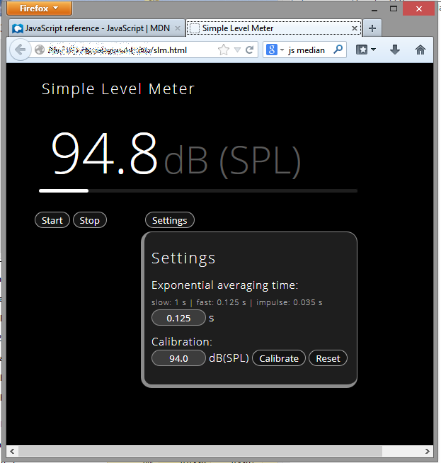

#Sound Level Meter for the browser with WebSockets
This repository contains an implementation of a simple sound level meter displayed in the browser.
[PySoundCard][] is used for sound card input and tornado WebSockets are used to communicate between python and javascript  in the html page.
In the browser it looks like this:

##Getting started
Clone this repo, be shure to have the modules pycparser, cffi, pysoundcard and tornado being installed.
If you are a windows user i recommend to use [WinPython][] or a compareable python distribution. With the package manager you can install windows binaries. The pycparser and cffi are easy to get from the [Unofficial Windows Binaries][] page from Christoph Gohlke. The tornado package is already installed on WinPython. Binaries for PySoundCard are plased on the [PysoundCard][] page from bastibe ready to download and install.

[WinPython]: http://winpython.sourceforge.net/
[Unofficial Windows Binaries]: http://www.lfd.uci.edu/~gohlke/pythonlibs/
[PySoundCard]: https://github.com/bastibe/PySoundCard/

##Usage
Just run the file `slm.py`. This will pop up the browser and show the simple level meter. With the `start` and `stop` button you control the data stream. The `settings` button gives you the options to set the averaging time and to calibrate your sound level meter with a calibrator.
You can open the `slm.html` another time. This will connect to another WebSocket and you can specify different settings and view the measured levels in many browser windows with different settings.
With the `bottle_web_server.py` you can start a web server and connect from other devices to your host by calling `http://address_to_your_host:9090/slm`. This will show you the stream on your other device.

##Future
For the future there are some plans to support weightings like A, B, and C-weighting. Maybe the communication over the WebSocket will be refactored to support a fractional octave view...

Have fun!

MIT license.
